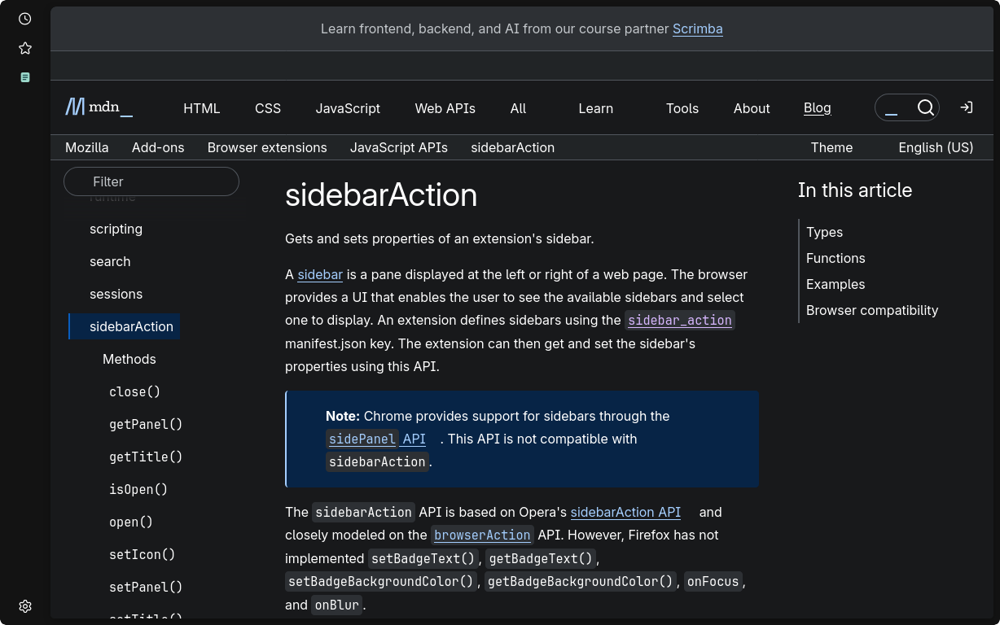
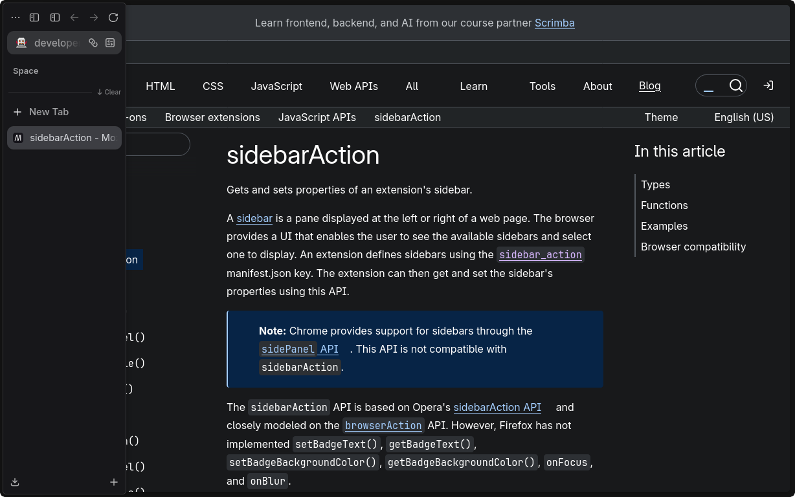
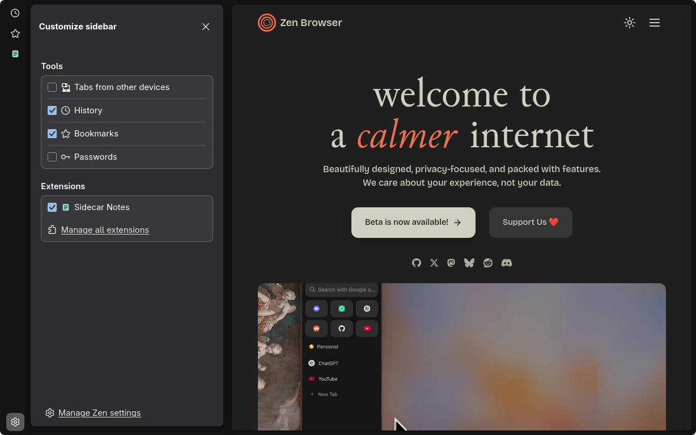
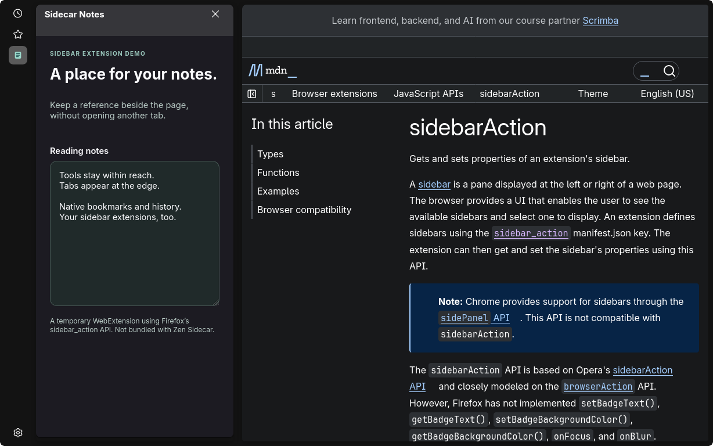
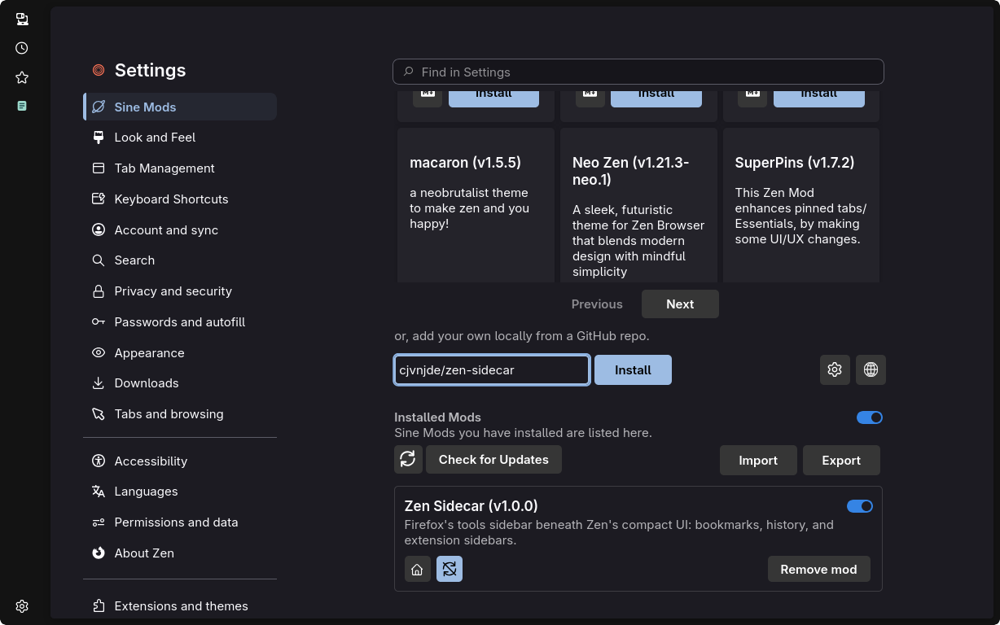

<p align="center">
  
</p>

<p align="center">
  <strong>A native tools rail. Zen’s tabs, only when you need them.</strong><br>
  Keep sidebar tools on the left while Zen’s compact toolbox floats over them at the screen edge.
</p>

<p align="center">
  <a href="#the-layout">The layout</a> ·
  <a href="#screenshots">Screenshots</a> ·
  <a href="#install">Install</a> ·
  <a href="#use-and-manage">Use &amp; manage</a> ·
  <a href="#troubleshooting">Troubleshooting</a>
</p>

---

## The layout

Zen Sidecar brings two existing browser surfaces together instead of building a replacement sidebar:

| Always within reach | There when you need it |
| --- | --- |
| A slim, native tools rail on the left | Zen’s compact toolbox, revealed from the left edge |
| Built-in sidebar tools and sidebar-capable extensions | Zen’s own tabs and navigation, floating over the rail |
| Native tool customization and extension management | No second set of Firefox vertical tabs |

Hovering a **tool icon does not reveal the tab toolbox**. Move to the **very left edge** to bring Zen’s compact UI forward; use the rail itself to open tools. Sidebar extensions remain ordinary browser extensions, managed through Zen—not copies embedded in this mod.

The rail trims horizontal padding without shrinking native icons or button backgrounds. Firefox’s compact density remains compact.

> [!IMPORTANT]
> **This is a privileged JavaScript mod, not an XPI or a CSS-only theme.** Sine loads its code into the browser UI with browser-level privileges, outside the normal extension permission model. Review this repository and trust its author before installing. Zen Sidecar is a custom GitHub installation; it is not represented as listed, reviewed, or approved by the Sine marketplace.

## Screenshots

Actual captures from an isolated Zen profile, not browser mockups. The header graphic above is a decorative illustration.

### A quiet default



### Tabs at the edge



<details>
<summary><strong>Tool choices, sidebar extensions, and Sine installation</strong></summary>

### Just the settings you need



### A real sidebar extension



This capture uses a temporary demo extension with Firefox’s `sidebar_action` API. The notes panel is not bundled with Zen Sidecar.

### Managed by Sine



</details>

## Install

### 1. Set up Sine

Install Sine for the Zen profile you intend to use, following the **[official installation guide](https://github.com/sineorg/docs/blob/main/src/installation.md)**. Downloads are available from **[Sine releases](https://github.com/CosmoCreeper/Sine/releases/)** and **[Sine bootloader releases](https://github.com/sineorg/bootloader/releases/)**. Restart Zen and check that **Sine Mods** appears in Settings before continuing.

> [!NOTE]
> **Linux Flatpak needs manual Sine setup.** The [official FAQ](https://github.com/sineorg/docs/blob/main/src/faq.md#why-is-installation-failing-on-linux) says the current auto-installer does not support Flatpak. Follow the manual installation guidance, using paths appropriate to your Flatpak installation and profile; do not point the ordinary Linux installer at the Flatpak executable. Zen Sidecar does not include a separate installer or bootloader. Preserve any existing unrelated loader and resolve conflicts before installing Sine.

<details>
<summary><strong>File locations for the tested Zen Flatpak</strong></summary>

After downloading the official Sine bootloader and engine, the tested layout is:

| Sine release content | Destination |
| --- | --- |
| `profile.zip` → `utils/` | Your Zen profile’s `chrome/utils/` |
| `engine.zip` → `JS/` | Your Zen profile’s `chrome/JS/` |
| `program.zip` → `config.js` | `$DEPLOYMENT/files/etc/zen/config.js` |
| `program.zip` → `defaults/pref/config-prefs.js` | `$DEPLOYMENT/files/zen/defaults/pref/config-prefs.js` |

Find your profile through `about:support`. For `app.zen_browser.zen`, find `$DEPLOYMENT` with `flatpak info --show-location app.zen_browser.zen`. Create the profile’s `chrome/sine-mods/` directory if absent. Close Zen before changing loader files, preserve unrelated configuration, and use only the permissions needed to write those locations. Flatpak updates can replace application-side bootloader files; profile-side mods remain separate.

</details>

If you used this project’s earlier standalone AutoConfig setup, complete the [one-time migration](#migrating-from-the-old-standalone-setup) first. Do not run both loaders.

### 2. Allow this custom JavaScript source

1. Open Zen **Settings → Sine Mods**. You can also enter `about:preferences#sineMods` in the address bar.
2. Beside the custom repository input, click the button whose tooltip is **Open settings**.
3. Under **General**, enable **“Enable installing JS from unofficial sources. (unsafe, use at your own risk)”**.
4. Click **Close**.

This is Sine’s `sine.allow-unsafe-js` preference. It is **global consent for JavaScript from unofficial sources**, not a permission limited to Zen Sidecar. Leave it off if you do not trust that scope. It must remain enabled for this custom mod’s scripts to load; the mod does not bypass that check. You do **not** need to enable an external marketplace or change its URL.

### 3. Add the repository

In **Sine Mods**, below the marketplace list, find the input with the placeholder **`username/repo (folder if needed)`**. Paste:

```text
cjvnjde/zen-sidecar
```

Click **Install**. This installs from **[github.com/cjvnjde/zen-sidecar](https://github.com/cjvnjde/zen-sidecar)**. Find **Zen Sidecar** under **Installed Mods**, leave its individual mod toggle enabled, then **restart Zen**.

There is no XPI to drag into the browser, no manual `userChrome.css` import, and no Python command to run.

### 4. Choose your compact layout

In Zen’s toolbar context menu, open **Compact Mode**, enable it, and choose **Hide sidebar** or **Hide both**. Sidecar does not change your compact-mode settings. The rail also works outside compact mode; full-screen web content hides it.

### Compatibility

Verified with **Zen 1.21.15b on Linux Flatpak, Sine 2.3.3, and bootloader 0.1.4**. The screenshots use an isolated profile on that setup. Other Zen versions, operating systems, and packaging formats are **unverified**. This mod depends on internal browser UI APIs; a Zen or Sine update can require a compatibility change.

## Use and manage

- **Open a tool:** click its icon in the left rail. Use the native sidebar customization control to choose tools; manage sidebar extensions in Zen’s Add-ons Manager (`about:addons`). Only extensions that provide a sidebar can appear here.
- **Choose your tools:** the gear opens native tool and extension choices. Checking or unchecking an item changes visibility, not its saved position. Sidecar hides the vertical-tabs, side-placement, and launcher-behavior settings because its layout is fixed.
- **Reorder tools:** drag a tool or extension icon directly on the rail. Drop above or below another icon at the insertion line. The gear stays at the bottom. With an icon focused, **Alt+Shift+Up/Down** moves it one position without opening it.
- **Keep your order:** positions are saved across restarts and shared by windows in the same profile. Hidden tools and temporarily unavailable extensions keep their place; newly discovered items are appended.
- **ChatGPT in the sidebar:** use Zen’s native **AI chatbot** tool and select **ChatGPT** in its provider chooser. If the tool is absent on the tested Zen version, set `browser.ml.chat.enabled` to `true` in `about:config`, then enable **AI chatbot** in the rail’s gear menu. This uses the browser’s existing chatbot panel, not a Sidecar bookmark. Arbitrary website bookmarks opening in the rail are not supported.
- **Reach your tabs:** move to the very left edge, then into the revealed Zen toolbox. Tool icons are not the tab-reveal target.
- **Disable:** in **Settings → Sine Mods → Installed Mods**, use Zen Sidecar’s individual toggle, whose tooltip is **Disable mod**. Do not use the global **Disable all mods** toggle unless that is what you want. Use **Enable mod** to turn it back on.
- **Remove:** choose **Remove mod** on Zen Sidecar and confirm. Keep Sine installed if you use other mods; do not remove Sine’s loader to uninstall Sidecar.
- **Update:** use **Check for Updates** under **Installed Mods**, or Sine’s **Auto-Update** control. Review upstream changes before accepting privileged code updates. **Restart Zen after updates or configuration changes** so cached runtime helpers cannot leave the old code active.

Enabling and disabling are managed by Sine. There is no second standalone loader to maintain. Restart after disabling or removing if the browser still displays stale UI.

## Troubleshooting

| Symptom | What to check |
| --- | --- |
| **Sine Mods** is missing | Sine has not loaded in this profile. Check its [installation guide](https://github.com/sineorg/docs/blob/main/src/installation.md) and [FAQ](https://github.com/sineorg/docs/blob/main/src/faq.md); Flatpak requires manual setup. |
| The mod is installed but there is no tools rail | Check the individual mod toggle, the global mods toggle, and `sine.allow-unsafe-js`. Restart Zen after allowing unofficial scripts. CSS alone cannot activate this mod. |
| Hovering an icon does not show tabs | That is intentional. Move to the **very left edge** to reveal the compact toolbox. |
| A particular extension is absent | Confirm it provides a browser sidebar and is enabled in `about:addons`; check the native sidebar customization controls. A toolbar-only extension cannot become a sidebar tool. |
| Two rails, overlapping UI, or behavior that persists after removal | Check for the old standalone files below and other sidebar/compact-mode mods. Disable conflicting mods individually, then restart. |
| An update looks unchanged | Fully restart Zen. If needed, use **Clear Startup Cache** in `about:support`, as described by Sine’s setup guide. |

For a reproducible issue, [open a report](https://github.com/cjvnjde/zen-sidecar/issues) with your Zen/Sine versions, OS and packaging format, reproduction steps, and a screenshot without personal information. Say whether it also occurs in an isolated profile with only Sine and Zen Sidecar.

## Migrating from the old standalone setup

<details>
<summary><strong>Only for users of this project’s former AutoConfig installer</strong></summary>

The Sine version replaces the earlier standalone installation; it is not an additional layer. Back up the affected files and identify the active profile with `about:support` **before closing all Zen windows**. Remove only files belonging to that earlier Zen Sidecar installation:

| Location | Old Sidecar-owned files |
| --- | --- |
| Each profile where you installed the standalone version | `chrome/zen-sidecar.js` and `chrome/zen-sidecar.css` |
| Zen’s application installation | `defaults/pref/zen-sidecar.js` |
| The AutoConfig directory | `zen-sidecar.cfg`—usually in the application directory; for the former Flatpak setup, under the deployment’s `files/etc/zen/` |

The old `defaults/pref/zen-sidecar.js` identifies itself as Zen Sidecar and sets `general.config.filename` to `zen-sidecar.cfg`. If a file does not match that ownership, do not delete it blindly. A shared application loader may serve multiple profiles; check those profiles before removing it.

**Do not delete or replace Sine’s `config.js` or `defaults/pref/config-prefs.js`. Do not overwrite unrelated AutoConfig loaders, `userChrome.css`, or `user.js`.** If you manually added a Sidecar import or loader call elsewhere, remove only that Sidecar-specific entry. The old profile-root CSS is separate from Sine’s managed copy of this mod.

Restart Zen, finish Sine setup if necessary, and install `cjvnjde/zen-sidecar` through the instructions above. From then on, use Sine’s toggle and removal controls—not the former standalone installer or its enable preference.

</details>

## Publishing updates

For each code release, bump `version` and set `updatedAt` in `theme.json` to the current full UTC timestamp, including the time (for example, `2026-09-14T11:14:24Z`). Sine compares `updatedAt`, not version numbers; date-only values miss multiple releases on the same day.

### 1.1.0

- Drag tool and extension icons to reorder the rail, with insertion feedback.
- Keep order independent of checkbox toggles, including hidden and temporarily unavailable items.
- Persist order across restarts and synchronize it between profile windows.
- Add keyboard reordering with Alt+Shift+Up/Down.

Ordering regression checks: `node --test tests/order.test.mjs`. Runtime verification also covers native mouse dragging, checkbox changes, sidebar extensions, multiple windows, restart persistence, and Sine disable/re-enable on the compatibility setup above.

## License and acknowledgments

Zen Sidecar is available under the **[MIT License](LICENSE)**.

Built for **[Zen Browser](https://zen-browser.app/)**, using its compact toolbox and the native sidebar infrastructure inherited from **[Mozilla Firefox](https://www.mozilla.org/firefox/)**. Installation and mod lifecycle are provided by **[Sine](https://github.com/CosmoCreeper/Sine)** and its **[bootloader](https://github.com/sineorg/bootloader)**. This is an independent project, not an official Zen, Mozilla, or Sine release.
